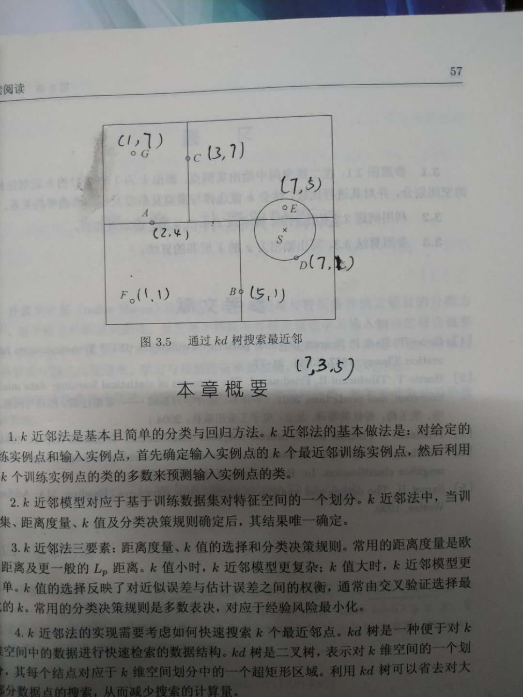

# 第一点：kd树的理解以及算法过程

* 理解概要
  
  kd树其实是一个二叉树，表示对k维空间的一个划分，构造kd树的过程相当于不断的用超平面对特征维度进行切割

  1.构造根节点（包含所有数据）

  2.利用递归不断切分空间，直到子区域没有实例结束。

  平衡二叉树，通常是对每一个特征依次选取作为划分维度，选取该特征的中位数作为切分点。（注意平衡二叉树搜索是未必是最快的）

* 创建算法过程
  
  1.构造一个包含所有数据的根节点，以第一个特征维度作为划分维度，取所有实例点在这个维度上的坐标的中位数作为切分点，在这个维度上的坐标与该中位数进行比较，比它小的进入左子树区域，比它大的进入右子树区域。这样就由根节点生成了深度为一的两个左右节点

  2.重复进行，对深度为j的节点选取第j+1个特征维度作为划分的维度，计算这个维度上的所有坐标的中位数，以这个中位数作为切分点，对包含的数据进行不断的划分，直到两个子区域没有实例点为止。（注意这里的j+1个维度作为划分的维度，当我们用到最后一个维度下一次重新回到第一个维度就行，代码就直接对总维度数取模就ok）

* 搜索算法实现
  
  1.首先要有已经构建好的kd树，和目标点

  2.在kd树中寻找包含目标点的叶节点。这个过程类似于创建树的过程，从根节点开始，不断地与这些节点划分维度上的数值进行比较，比节点大进入右子树，小则进入左子树，直到到达叶节点。

  3.以所属叶节点作为最近的节点，计算距离，这个距离暂时也作为最近的距离。

  4.回溯，这个会比较复杂一点，我们对于最近节点还要检查它的父节点和兄弟节点是否会离目标点更近，计算方法是计算目标点以当前最小距离作为半径的超球体与父节点超平面的距离，而这个超平面是父节点按照它所划分的维度划分出来的。（这里在实现这一个判断的时候还有一些技巧）。如果这个距离小于当前的最小距离，那么兄弟节点以及它生成的树中可能会存在更近的点。（**注意这里还要包括它所生成的树**）那么我们就要去到另一边找，至于怎么找第五点说；如果没有就回溯。

  5.**对于回溯的实现我们可以使用列表来模拟栈，保留最初寻找初始最近点过程中的路径，这样在实现回溯就只需要一个个pop出来，先进先出，这样子pop出来的就会是回溯前的父节点。同时如果判断到兄弟节点以及它生成的树中可能会存在更近的点，那么我们就去另一边找，一旦有换到另一边子树去找到的情况，都要再搞一次类似于我们找初始最近点的过程，路径就qppend进我们的栈，然后就是不断重复操作的过程。**

# 第二点：kd树代码

按照上面思路实现的kd树构造（保姆级注释）
```
class Node:
    def __init__(self, value):
        self.value = value  # 该节点数据
        self.axis = None  # 该节点划分维度
        self.right = None  # 右子树
        self.left = None  # 左子树


def create_tree(values, axis, shape_1):
    """
    递归构造kd树
    :param values: 传入数据，类型array矩阵
    :param axis:   划分维度，类型int
    :param shape_1: 特征数，类型int
    :return:根节点，类型Node object
    """
    if values.size == 0:  # 如果已经没有数据传进，说明已经划分到叶节点了，返回None
        return None
    data_axis = values[:, axis % shape_1]  # 取出划分维度上的数据
    sort_axis = np.sort(data_axis)  # 对划分维度上的数据进行排序
    median_data = sort_axis[sort_axis.__len__() // 2]  # 取出中位数
    left_data = values[values[:, axis % shape_1] < median_data]  # 左子树数据
    right_data = values[values[:, axis % shape_1] > median_data]  # 右子树数据
    node = Node(values[values[:, axis % shape_1] == median_data])  # 该节点
    node.axis = axis % shape_1  # 保存当前划分维度，后面搜索的时候要用到
    node.left = create_tree(left_data, axis + 1, shape_1)  # 递归
    node.right = create_tree(right_data, axis + 1, shape_1)
    return node
```

最近点搜索的算法,这个比较坑，中间实现的过程遇到各种奇葩问题

**首先是取出某一维度上的数据注意这些数据的类型，类型不一样取的方式不同，于是构造和搜索以及传入的目标点的数据我们统一使用array矩阵，就算是一个点（1，2）也要给我搞成[[1, 2]]这样子，取某一维度上的数据就使用check_point[:, p_tail.axis]类似这样子的形式**

**第二个问题：“对于最近节点还要检查它的父节点和兄弟节点是否会离目标点更近，计算方法是计算目标点以当前最小距离作为半径的超球体与父节点超平面的距离”上面讲到这个与超平面的距离有计算的技巧，就是我们可以直接使用目标点与父节点在父节点划分维度上的距离**

**第三个问题是；当我们发现另一个子节点可能存在更近的点的时候，我们不是仅转移到那个点来检查，而是转移后再进行一次类似寻找初始最近点的过程并且存储经过的路径。**

第二个问题主要是看李航《统计学习方法》（图在下面）这本里面最后一个图中一直迷惑回溯到A后发现另一个子树区域中可能存在更近的点（因为S点与A划分维度上的距离明显小于这个半径），于是我们走到C点。但是S点与C点划分维度上的距离明显大于半径，然后就迷惑了，怎么跳到E点。最后发现我傻逼了，原来是要进行一次往下一直搜索到叶节点。因为我们在最初按照维度划分数据时有可能一些离目标点距离很近的点偏偏就是在这段很近的距离上被划分到不同的两簇树中，所以发现另一个子树区域中可能存在更近的点时都要先往下划分目标点所在位置，保存路径，这个过程完了再来回溯。



```
def search(root_point, check_point):
    p_tail = root_point
    stack = []  # 保存路径上的点
    while p_tail is not None:  # 这个while循环是找到最初的那个最近点
        stack.append(p_tail)
        if check_point[:, p_tail.axis] < p_tail.value[:, p_tail.axis]:
            p_tail = p_tail.left
        else:
            p_tail = p_tail.right
    min_distance = np.linalg.norm(check_point - stack[-1].value)
    min_point = stack[-1]
    while len(stack) != 0:
        pop_point = stack.pop()
        distance = np.linalg.norm(check_point - pop_point.value)
        if distance < min_distance:
            min_distance = distance
            min_point = pop_point
        # 下面是一个判断是否回溯的过程，激动死我了，终于想明白怎么弄了
        # 当你判断出父节点的另一个子树中有可能存在更近的点时，一定要重新按照上面那个递归的方法一直递归到底
        # 然后继续寻找，找到就更新最近点和最近距离，找不到更近的点就会一直回溯到栈为空时停止
        if np.linalg.norm(check_point[:, pop_point.axis]-pop_point.value[:, pop_point.axis], ord=1) < min_distance:
            if check_point[:, pop_point.axis]-pop_point.value[:, pop_point.axis] > 0 and pop_point.left is not None:
                p_tail = pop_point.left
                while p_tail is not None:
                    stack.append(p_tail)
                    if check_point[:, p_tail.axis] < p_tail.value[:, p_tail.axis]:
                        p_tail = p_tail.left
                    else:
                        p_tail = p_tail.right
            if check_point[:, pop_point.axis] - pop_point.value[:, pop_point.axis] < 0 and pop_point.right is not None:
                p_tail = pop_point.right
                while p_tail is not None:
                    stack.append(p_tail)
                    if check_point[:, p_tail.axis] < p_tail.value[:, p_tail.axis]:
                        p_tail = p_tail.left
                    else:
                        p_tail = p_tail.right
    return min_distance, min_point
```

# 第三点：结合代码实现理解kd树的好处
**搜索快**，通过实现过程也可以理解得到kd树可以减少很多不必要的搜索，因此可以大大提高搜索效率，尤其是对于训练集数据量很大时，使用普通的knn计算会非常耗时。